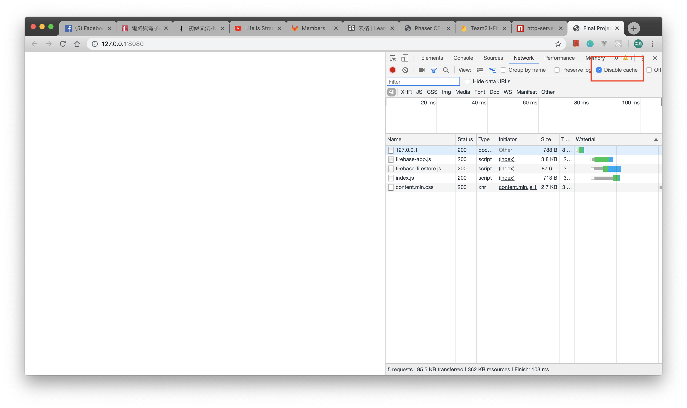

# 軟實 Final Project 計畫

## 開發流程

- 可以直接使用 Firefox，想用 Chrome 可以先 npm install，然後再打 npm run serve，點開裡面寫的網址(記得在 Chrome dev tool 裡的 network 打開 `Disable cache`)



## Game Flow 遊戲流程

整體遊戲相關進程，根據 Phaser 特性([State](https://photonstorm.github.io/phaser-ce/Phaser.State.html))來定義遊戲進程。

### High Risk 高風險

必須要有的東西

| Game State 遊戲階段 | Content 階段內容                | Developer 開發者 |
| ----------------- | ----------------------------- | --------------- |
| Menu              | 開始頁面的圖像、Position、UI 設計  |                 |
| Tutorial          | 設計教學頁面，page 設計           |                 |
| MainGame          | 主要遊戲內容，定義了全部遊戲邏輯      |                 |
| EndGameMenu       | 結束頁面的圖像、Position、UI 設計   |                |

### High Value 高價值

做了應該會更乾淨，更高級的 State.

| Game State 遊戲階段 | Content 階段內容                                  | Developer 開發者 |
| ----------------- | ----------------------------------------------- | --------------- |
| Pause Menu        | 暫停畫面直接切出去一個 State, 要做 State 間資訊紀錄和轉移 ||

## 各個 State 功能列表

下面會列出每個 State 裡該有的功能，以及其功能細部需求。以功能分類

### Main Game 遊戲主體邏輯

#### 多人連線模組

- Main Requirement: 主要要能記錄各個遊戲物件現在的資料為何，並且在有新資料進來時更新到本機端。
- Implementation: 有一個連接器，可以加入 firebase realtime update，並且在物件刪除時一並刪除 Callback
- Input: Js 物件建構，只是一個控制器，各個 Function 獨立
- Implementation Detail: Below

##### DB 路徑定義

|- rooms(collection)
|---- [room_id](doc)
|------- game
|---------- To be Added.
|------- player1(doc)
|------- player2(doc)

##### Class 物件定義

```js
// 物件定義
class Connector {
  /** 
    Construct A Connect
    @constructor
    @param { String } roomId, 房間 ID，用在辨別 DB 位置
    @param { String } playerId, 玩家獨有 ID，用在辨別 DB 位置
  */
  constructor(roomId, playerId) {
    // ....
  }
}

// 產生物件
let connector = new Connector('[roomId]', '[playerId]');
```

##### addToDB()

```js
/**
    @name addToDB
    @param { String } key, 用在 DB 路徑
    @param { Phaser.Sprite, Any } object, 任何要記錄的物件
    @return { Phaser.Sprite, Any }, 之前透過 object 傳進來的物件
  */
  function addToDB(key, object);
```

## 相關文件連結

- [Phaser CE 官方文件](https://photonstorm.github.io/phaser-ce/)
- [Git 常用指令文件](http://gitqwerty777.github.io/git-commands/)